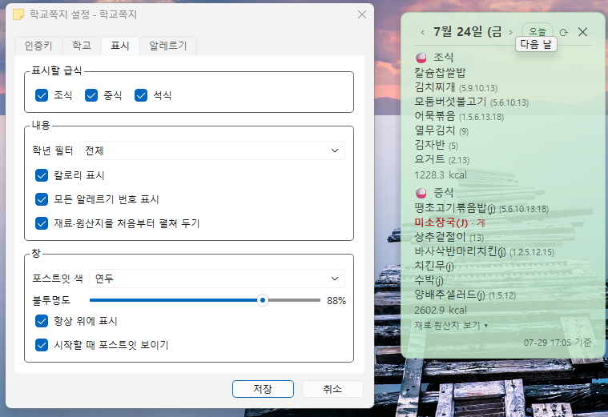

# 📌 학교쪽지 (SchoolNote)



> 오늘 우리 학교의 **급식 메뉴**와 **학사일정**을,
> 누군가 책상에 슬쩍 붙여둔 포스트잇처럼 보여주는 데스크톱 위젯.

바탕화면 한구석에 조용히 붙어 있다가, 지나가며 흘깃 보면 오늘 뭘 먹는지 알 수 있습니다.
방해되면 클릭 한 번으로 숨기고, 트레이 아이콘을 누르면 다시 나타납니다.

데이터는 교육부 **NEIS 교육정보 개방 포털**의 공식 Open API에서 가져옵니다.

<!-- TODO: 스크린샷 추가 -->

---

## ✨ 특징

- **포스트잇 UI** — 제목표시줄 없는 반투명 창. 드래그로 원하는 곳에 붙여두면 위치가 기억됩니다.
- **트레이 상주** — 숨겨도 트레이 아이콘은 항상 남습니다. 클릭하면 다시 표시.
- **손 안 대도 갱신** — 자정이 지나면 스스로 그날 정보를 가져옵니다.
- **어제·내일도 확인** — 마우스 휠을 굴리거나 `‹ ›` 버튼으로 날짜를 넘깁니다. 한 번 본 날은 캐시에서 바로 뜹니다.
- **알레르기 경고** — 설정에 등록한 알레르기가 들어간 음식은 재료까지 빨갛게 표시됩니다.
- **재료는 접어둡니다** — 평소엔 메뉴만, 포스트잇을 클릭하면 원산지·영양 정보가 펼쳐집니다.
- **학교 검색** — 학교 이름 일부만 입력하면 목록에서 골라 설정할 수 있습니다.
- **인증키 검증 버튼** — 키를 붙여넣고 **[키 확인]** 한 번이면 맞는지 바로 알려줍니다.
- **크로스플랫폼** — Windows / macOS / Linux
- **서버 없음** — 앱이 NEIS API를 직접 호출합니다. 개인정보가 어디로도 전송되지 않습니다.

---

## 🚀 시작하기

### 요구 사항

- Python 3.12 이상
- NEIS 개방포털 인증키 (무료, 아래 안내 참조)

### 개발 환경 실행

```bash
git clone <저장소 주소>
cd project1

python -m venv .venv
# Windows
.venv\Scripts\activate
# macOS / Linux
source .venv/bin/activate

pip install -r requirements.txt
python -m app
```

첫 실행 시 설정 창이 자동으로 열립니다.

---

## 🔑 NEIS 인증키 발급 방법

앱 안의 **설정 → 인증키** 탭에도 같은 안내가 들어 있고, 발급 페이지로 바로 가는 버튼도 있습니다.

1. <https://open.neis.go.kr> 접속 후 **회원가입**
2. 상단 메뉴에서 **인증키 신청** 선택
3. 활용 목적을 간단히 입력하고 신청 — **무료이며 즉시 발급**됩니다
4. **마이페이지**에서 발급된 인증키를 복사
5. 앱의 **설정 → 인증키** 탭에 붙여넣고 **[키 확인]** 클릭
6. ✅ 표시가 뜨면 **학교** 탭으로 넘어가 학교를 검색해 선택

> 공공데이터포털(data.go.kr)에도 같은 데이터셋이 등재돼 있지만,
> **실제 호출에 쓰는 인증키는 NEIS 개방포털에서 발급**받아야 합니다.

### 인증키는 어디에 저장되나요?

OS의 자격증명 저장소(Windows 자격 증명 관리자 / macOS 키체인 / Linux Secret Service)에 저장됩니다.
설정 파일이나 저장소에는 기록되지 않습니다. 자세한 내용은 [PRD 5.3](docs/PRD.md)을 참고하세요.

---

## 📦 빌드 (배포용 실행 파일)

PyInstaller로 OS별로 각각 빌드합니다. **크로스 빌드는 불가능**하며, 배포하려는 OS에서 직접 빌드해야 합니다.

```bash
pip install -r requirements-dev.txt
pyinstaller schoolnote.spec --noconfirm
```

| OS | 산출물 | 상태 |
| --- | --- | --- |
| Windows | `dist/SchoolNote/SchoolNote.exe` | ✅ 빌드·실행 확인 (약 115MB) |
| macOS | `dist/SchoolNote.app` | 미검증 |
| Linux | `dist/SchoolNote` | 미검증 |

쓰지 않는 Qt 모듈은 `schoolnote.spec`의 `EXCLUDES`에서 제외하고 있습니다.

---

## 🗂 프로젝트 구조

```
project1/
├─ app/
│  ├─ __main__.py          # 진입점, 단일 인스턴스 보장, 로깅
│  ├─ controller.py        # 전체 흐름 조율 (조회 → 렌더 → 상태 표시)
│  ├─ tray.py              # 트레이 아이콘과 메뉴
│  ├─ sticky.py            # 포스트잇 위젯
│  ├─ settings_dialog.py   # 설정 창 (인증키 / 학교 / 표시)
│  ├─ config.py            # 설정 로드·저장, 경로 결정
│  ├─ secrets_store.py     # 인증키 보관 (keyring + 폴백)
│  ├─ cache.py             # 날짜 단위 응답 캐시
│  ├─ allergens.py         # 알레르기 19종 표준 코드와 낱말 매칭
│  ├─ scheduler.py         # 자정 롤오버 감지
│  ├─ workers.py           # 백그라운드 작업 실행기
│  ├─ neis/
│  │  ├─ client.py         # HTTP 호출, 타임아웃, 재시도
│  │  ├─ codes.py          # RESULT.CODE 분류
│  │  ├─ models.py         # School / MealMenu / ScheduleEvent
│  │  └─ parser.py         # 응답 정규화
│  └─ resources/
│     ├─ icons.py          # 아이콘을 코드로 그린다 (바이너리 없음)
│     └─ theme.py          # 포스트잇 색상 팔레트
├─ docs/
│  └─ PRD.md               # 제품 요구사항 명세서
├─ tests/
│  ├─ test_parser.py       # 응답 파싱
│  ├─ test_allergens.py    # 알레르기 매칭
│  ├─ test_config.py       # 설정 병합·마이그레이션
│  ├─ test_ui_smoke.py     # offscreen 위젯 렌더
│  └─ test_day_navigation.py  # 날짜 이동
├─ sandbox/                # 본체와 무관한 연습 파일
├─ run.py                  # PyInstaller 진입 스크립트
├─ schoolnote.spec         # PyInstaller 빌드 설정
├─ requirements.txt
├─ requirements-dev.txt
└─ README.md
```

## 🧪 테스트

```bash
pip install -r requirements-dev.txt
pytest -q
```

UI 테스트는 `QT_QPA_PLATFORM=offscreen` 으로 실행되므로 화면 없이도 돌아갑니다.

---

## 🔌 사용하는 API

| 서비스 | 엔드포인트 | 용도 |
| --- | --- | --- |
| 학교기본정보 | `/hub/schoolInfo` | 학교 검색, 인증키 검증 |
| 급식식단정보 | `/hub/mealServiceDietInfo` | 급식 조회 |
| 학사일정 | `/hub/SchoolSchedule` | 행사·일정 조회 |

베이스 URL: `https://open.neis.go.kr`
상세 파라미터와 응답 항목은 [PRD 6장](docs/PRD.md)에 정리돼 있습니다.

---

## 🗺 로드맵

- **v0.1 (MVP)** — 포스트잇 위젯, 트레이, 설정(인증키 검증 + 학교 검색), 자동 갱신, Windows 빌드
- **v0.2** — 표시 옵션 전체, 자동 시작, macOS/Linux 빌드, 오프라인 캐시
- **백로그** — 여러 학교 등록, 내일 급식 미리보기, 특정 메뉴 알림, 주간 요약

---

## 📄 문서

- [제품 요구사항 명세서 (PRD)](docs/PRD.md)

---

## ⚖️ 라이선스 및 출처

- 급식·학사일정 데이터 출처: **교육부 NEIS 교육정보 개방 포털** (<https://open.neis.go.kr>)
- 본 프로젝트는 교육부·시도교육청과 무관한 비공식 개인 프로젝트입니다.
